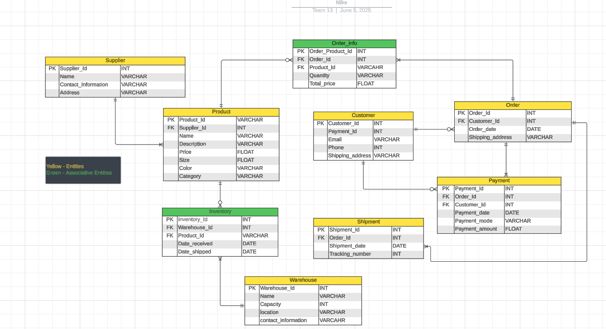

# 👟 Nike Shoe Sales Database  

A hands-on relational-database project that tracks the complete life-cycle of Nike shoe sales, from sourcing products all the way to delivery at a customer’s door.  
The model was **first sketched in Lucidchart** (to nail down the relationships) and then **built table-by-table in DBeaver**.  
Everything you need to understand the design and rebuild it yourself is right here in this README.

---

## 🗂️ Entity-Relationship Diagram (ERD)

> Yellow = Core entities | Green = Associative / junction entities

 

---

## 🧱 Table-by-Table Breakdown

| # | Table | Purpose | Selected Columns* |
|---|-------|---------|-------------------|
| 1 | **Supplier** | Who ships products to Nike | `Supplier_Id` (PK), `Name`, `Contact_Information`, `Address` |
| 2 | **Product** | Every Nike shoe we sell | `Product_Id` (PK), `Supplier_Id` (FK), `Name`, `Description`, `Price`, `Size`, `Color`, `Category` |
| 3 | **Warehouse** | Where stock physically lives | `Warehouse_Id` (PK), `Name`, `Capacity`, `Location`, `Contact_Information` |
| 4 | **Inventory** | Current stock holdings (junction of Product × Warehouse) | `Inventory_Id` (PK), `Warehouse_Id` (FK), `Product_Id` (FK), `Date_received`, `Date_shipped` |
| 5 | **Customer** | Buyers of our shoes | `Customer_Id` (PK), `Name`, `Email`, `Phone`, `Shipping_address`, `Payment_Id`† |
| 6 | **Order** | Each checkout event | `Order_Id` (PK), `Customer_Id` (FK), `Order_date`, `Shipping_address` |
| 7 | **Order_Info** | Line items inside an order (junction of Order × Product) | `Order_Product_Id` (PK), `Order_Id` (FK), `Product_Id` (FK), `Quantity`, `Total_price` |
| 8 | **Payment** | How money changes hands | `Payment_Id` (PK), `Order_Id` (FK), `Customer_Id` (FK), `Payment_date`, `Payment_mode`, `Payment_amount` |
| 9 | **Shipment** | Parcel tracking & final-mile delivery | `Shipment_Id` (PK), `Order_Id` (FK), `Shipment_date`, `Tracking_number` |

\* Only the most instructive columns are shown here; see the ERD for full details.  
† `Payment_Id` in **Customer** supports a one-to-one “default payment method” if desired.

---

## 🔄 Data Flow in Plain English

1. **Suppliers** list products → **Product** table.  
2. Products are stocked in **Warehouses**; movements are logged in **Inventory**.  
3. A **Customer** places an **Order**.  
4. Each shoe in that cart becomes a row in **Order_Info**.  
5. The customer pays; a matching record is written to **Payment**.  
6. The warehouse ships; tracking data lands in **Shipment**.  
7. Inventory updates, and the cycle repeats.

---

## 🚀 Re-Creating the Project Yourself

| Step | What to Do | Tips |
|------|------------|------|
| 1 | **Install software** | *DBeaver* Community Edition + any SQL engine you like (MySQL, Postgres, SQLite…) |
| 2 | **Study the ERD** | Open the PNG/diagram to grasp keys & cardinalities. |
| 3 | **Create the 9 tables** | Use DBeaver’s Table Editor or run SQL DDL of your own. |
| 4 | **Add the foreign-key constraints** | Follow the lines/arrows in the diagram exactly. |
| 5 | **Populate sample data** | DBeaver’s spreadsheet view makes manual entry painless; import CSVs if you prefer. |
| 6 | **Generate your own ERD** | In DBeaver: *Database* → *ER Diagram* → it auto-draws from your schema. Confirm it mirrors the Lucidchart version. |
| 7 | **Run test queries** | Example: *“Top-selling models by revenue”* or *“Days between order and delivery”*. |

---

## 💡 Why This Design Works

* **Normalized** – minimal redundancy, easy maintenance.  
* **Extensible** – add promotions, returns, or user roles without major rewrites.  
* **Realistic** – mirrors how e-commerce platforms join orders, payments, and shipments.  

---

## Possible Next Steps

- Seed realistic sample data and publish analytics dashboards (Tableau / Power BI).  
- Add triggers for auto-restock when **Inventory** drops below threshold.  
- Integrate carrier APIs for real-time **Shipment** status updates.  

---

## 📄 License

[MIT](LICENSE)

---

## Author

**Lohit Satya Sai Chollangi** • lohithsatyasai@gmail.com • Built with Lucidchart + DBeaver 🛠️
